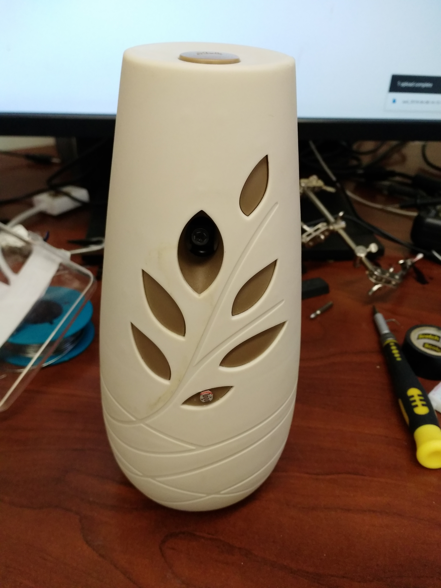

# silent-glade
Hacking of a automatic aroma spray to reduce night-time noise

## Problem

1. The spray noise disrupts sleep.
2. It wastes energy and scent when it sprays at an empty room.
3. Manually turning off at night or when I leave is bothersome.
4. Does not spray when I need it the most: when I just arrived at the room.

## Solution

Disable spray when room is dark using a light dependent resistor (LDR).

*Method.* The Glade spray have a manual button to trigger the spray. When this button is held down, the spray is disabled. To automatize the button press, a MOSFET is attached in parallel to this button and is enabled by a voltage divider formed by a LDR and a potentiometer. The potentiometer and LDR are set such that the MOSFET is triggered when the room is dark (LDR has high electrical resistance).

## Components

In addition to a working automatic spray,

- 10 k&Omega; potentiometer
- LDR GL55
- MOSFET ZVN2110

## Future Work

1. Connect spray to home network
2. Enable spray when resident is awake and in the room